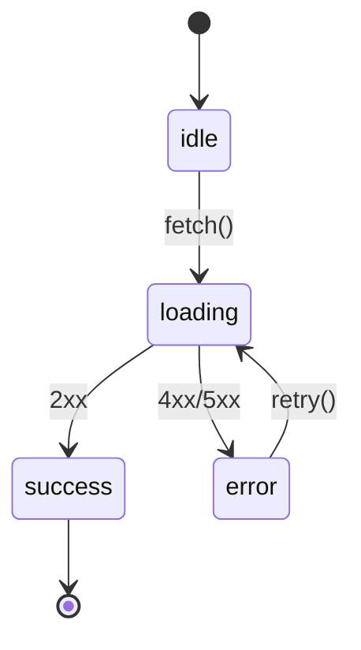

# TDD ルール (Kent Beck の Red → Green → Refactor)

この Skill が有効な間は、**セッションを通じて TDD 規律を維持する**。ユーザーが明示的に解除するまで、
各実装ファイルの編集前に必ず「失敗するテストが先にあるか」を確認する。プロジェクト固有のテスト実行コマンドや
テストフレームワーク詳細は、プロジェクト側の CLAUDE.md (`## コマンド`) を参照する。

## 大原則: テストを書かずに実装コードを書かない

ユーザーから機能追加・修正の依頼を受けたら、**最初に失敗するテストを書く**。実装から始めてはいけない。
「ちょっとした修正だから」「自明だから」もテスト先行の例外にしない。

## サイクル開始前: テストリストを書き出す

機能実装に着手する前に、思いつく **テストシナリオを洗い出してチェックリスト化** する (Kent Beck の "Test List" プラクティス)。サイクル中に集中力を切らさず、頭に浮かんだ別ケースを「あとでやる」リストに退避するため。

- 場所: プロジェクトルート直下の `.tdd/` フォルダ (`.gitignore` 済み、コミット対象外)。テストリストは `.tdd/test-list.md`。
  - 初回セットアップ: インポート先プロジェクトの `.gitignore` に `.tdd/` を追加する (一度だけ)。
- 形式: Markdown のチェックリスト (`- [ ] シナリオ`)
- 運用:
  - 着手時に自分でドラフトを作り、**スコープと順序を一度だけ軽く承認**してもらう (機能あたり 1 回)。承認済みリストは以降のサイクルの「次に何をやるか」を前倒しで合意した **機能単位のバッチ計画** になる。以降は作業しながら更新してよい (新シナリオの追記は自由)。
  - Green に到達したら該当行を `- [x]` に変える
  - 実装中に新しいシナリオを思いついたら追記する
  - 機能が完成して全項目チェック済みになったら `.tdd/` フォルダごと削除する

### (任意) 状態を持つ機能では状態遷移図を併記する

機能が以下のような **明確な状態と遷移** を持つ場合、`.tdd/state-diagram.md` に mermaid の `stateDiagram-v2` で図を書く。テストリストが「(現在状態, 入力イベント, 期待される次状態)」の形で自然に導出できるため、漏れを減らせる。

**書く価値がある例**:

- ライフサイクル系: 認証 (logged_out → logging_in → logged_in → expired)
- 非同期: idle → loading → success / error
- ウィザード / 多段フォーム
- パーサー / トークナイザ / ステートマシン
- リトライ・バックオフ・サーキットブレーカー

**書かなくてよい例** (作るとむしろ BDUF で害になる):

- 純粋関数 (計算、変換、整形、ソート等)
- 単純な CRUD で状態遷移が「存在しない / 存在する」の 2 値しかないもの

例 (非同期データフェッチ):

図を書いたら、各遷移 (矢印) ごとにテストリストへ 1 行追加する。`.tdd/state-diagram.md` も機能完成時に `.tdd/` フォルダごと削除する。

## TDD サイクル

各ステップを 1 つずつ完了させ、ステップごとに必ずテストを実行する。複数ステップをまとめて進めない。

### 1. 🔴 Red — 失敗するテストを書く

- 実装したい振る舞いを表す **最小のテスト 1 つ** を書く。
- 新しい振る舞いを駆動するテストは、実行して **意図した理由で失敗する** ことを確認してから Green に進む (コンパイルエラー / アサーション失敗)。
- まだ存在しない関数・コンポーネントへの import で落ちている段階でも「Red」と認める。
- 三角測量や保護網のテスト (既に一般化された実装に対するリグレッション防止用) は、最初からグリーンになっても許容する。

### 2. 🟢 Green — 最短でテストを通す

- テストを通す **最小限のコード** だけ書く。汚くてよい。
- 仮実装 (`return 1` のようなハードコード) で十分なら、それで通す。
- 「ついでにこっちも直そう」「もう一個メソッド足そう」を **絶対にしない**。スコープはテストが要求する範囲のみ。
- **プロジェクトのテスト実行コマンド** (プロジェクト側 CLAUDE.md の `## コマンド` を参照) でテスト全体がグリーンになることを確認する。

### 3. ♻️ Refactor — 重複と臭いを消す

- テストがグリーンの状態を保ったまま、重複除去・命名改善・抽象化を行う。
- リファクタリング中は **新しい振る舞いを足さない**。振る舞いの追加は次の Red から。
- リファクタごとにテストを走らせる。1 つでも落ちたら直前の変更を取り消す。

#### テストコードも Refactor 対象 — 重複テストの削除

実装コードと同じく **テストコード自体も DRY の対象**。複数のサイクルを経てスイートが安定したら、振る舞いが上位テストに完全包含されている下位テストは削除する。

**完全包含の例**: Test A が `button.click()` を含むなら、その前段で「ボタンが存在する」ことは暗黙にアサート済み → 「ボタン表示」単体テストは Test A に包含されている。同様に、上位の E2E が `waitForURL(/checkout/)` するなら、「ボタン押下で遷移する」だけを確かめる単体テストは包含される。

**判断手順**:

1. 削除候補のテストを 1 つ消す
2. スイート全体を実行
3. 残ったテストが Green を維持していれば削除確定
4. `test-list.md` のチェック (`- [x]`) は **残す** (シナリオ自体は引き続き検証されているため)

**削除しない判断** (これらは残す):

- **診断速度の差が大きい**: 上位テストが重い (E2E 30 秒など) のに対し、下位テストが軽い (unit 0.5 秒) 場合、smoke test として残す価値が高い
- **テストレイヤーが違う**: unit / integration / E2E で同じ振る舞いを検証していても、各レイヤーの責務が異なるので残す
- **保護網テスト**: §1 で明示的に「保護網」として書いたリグレッション防止用テストは、上位で担保されていても残す

#### テスト 1 本の中の重複: DAMP > DRY

スイート全体の整理 (上節) とは別に、**1 本のテストの中での記述スタイル**については **DAMP (Descriptive And Meaningful Phrases = 自己完結した記述)** を DRY より優先する。テストは将来の読み手 (人間 + AI agent) のドキュメントを兼ねるので、**1 本のテストを上から下まで読めば振る舞いが分かる** 自己完結性が読みやすさに直結する。

具体的には:

- **デフォルトは生 API 直書き** (例: `page.getByRole(...).fill(...)`)。重複が見えても急いで helper 抽出しない
- helper 関数 / Page Object Model の導入は、以下のような状況になってきた時に初めて検討:
  - テスト数 / 複雑度が増えて、重複そのものが構造的な保守負担になってきた
  - 外部依存 (例: Stripe Checkout) のセレクタ変更時、修正箇所を集約したい
  - ドメイン語彙 (`stripeCheckout.payWith({card})` 等) でテストの意図を表現したい
- 導入判断は **テスト数・複雑度・チームサイズ・読解性のバランス** を毎回評価する。「Rule of Three を機械的に適用」ではなく、必要に応じてレビュアーや AI と壁打ちして決める。

### 4. 三角測量 (Triangulation) — 一般化を強制する

- 仮実装 (ハードコード) で通したら、別の入力でもう 1 ケーステストを **AI 自身が追加** して一般化を強制する。**ユーザーには聞かない** (これは相談ではなく AI の規律)。
- 三角測量のケースも Red → Green を回してから、次の Refactor / サイクル境界へ進む。

### 5. 🔀 サイクル境界 — コミット前レビュー

各サイクル (Refactor 済み・全テスト Green・`- [x]` 更新済み) が完了したら、**サイクルあたり 1 回だけ** ここで停止する。サイクル途中では停止しない。

- その増分の **差分と提案コミットメッセージを提示して停止** し、ユーザーの承認を待つ。
- 承認されたら **コミット** し、承認済み test-list の **次項目** へ進む (次に何をやるかは着手時に合意済みなので、ここで改めて相談しない)。
- **1 サイクル = 1 コミット**。各コミットは Green かつリファクタ済みの原子単位なので、任意の境界へ `git revert` / `reset` でクリーンに戻せる。これが「勝手に大きく進めない」ためのガードレールになる。
- コミットは **軽量な固定規約** (振る舞い = test-list 項目を一行で表す簡潔なメッセージ) で打つ。すでにこのサイクル境界でレビュー済みなので、独自の分析や再確認を伴う **重いコミット用フローは挟まない** (二重確認・過剰処理を避ける)。
- `.tdd/` は `.gitignore` 済みなので、コミットには実装 (src) とテストの変更のみが入る。
- **例外エスカレーション**: 想定外のこと (新しいシナリオの発見、設計の分岐・曖昧さ、既存テストの破壊で方針判断が要る等) は、このサイクル境界のレビューで併せて相談する。
- ユーザーが「コミット不要」と明示した場合はコミット手順を省く (差分提示によるレビュー確認は残す)。

## 振る舞いの指示

- テストを書かずに実装ファイルを編集しようとしていることに気づいたら **手を止めて** 失敗テストの作成に戻る。
- ユーザーが「実装だけ書いて」と明示的に指示した場合のみ、TDD サイクルから外れてよい (その場合も明示的に確認する)。
- 既存テストを壊す変更を加えたら、新機能の追加よりも先にレッドの解消を最優先する。
- リファクタ提案をするときは「このリファクタはグリーンを保つ」ことを根拠付きで述べる。
- 仮実装で通したら、一般化を強制するため三角測量のケースを **AI 自身が追加** する (ユーザーには聞かない。§4 を参照)。
- ユーザーへの確認で停止するのは **着手時の test-list 承認** と **各サイクル境界のコミット前レビュー** の 2 種類に集約する。サイクルの途中では停止しない。
- Red → Green → Refactor の各遷移では **プロジェクトのテスト実行コマンド** を使う (ウォッチモードのキャッシュに惑わされないため)。
